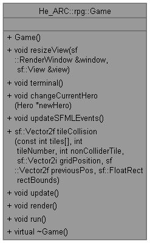
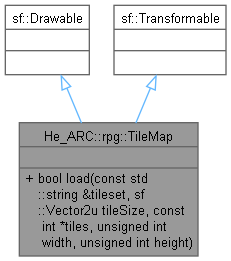
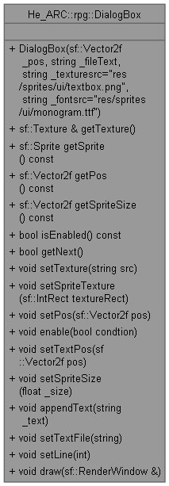
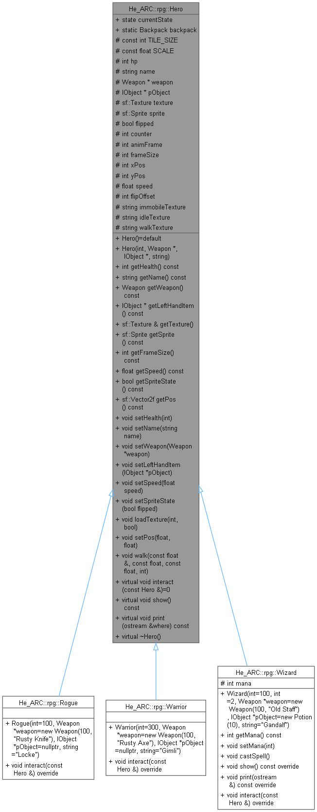
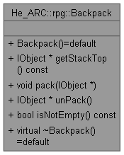
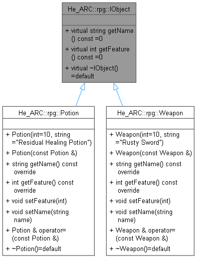
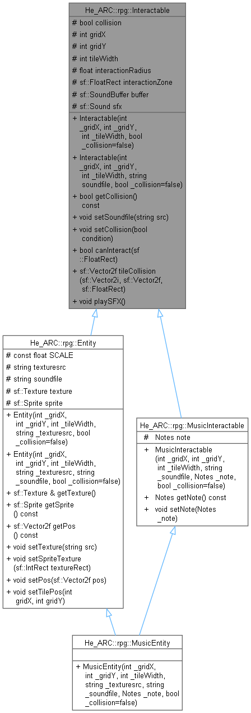

# UML Inheritance Diagrams
For more details you can check the html files generated by Doxygen in the doc folder.

## Game

## TileMap

## Dialog Box

## Hero

## Backpack

## IObject

## Interactable

